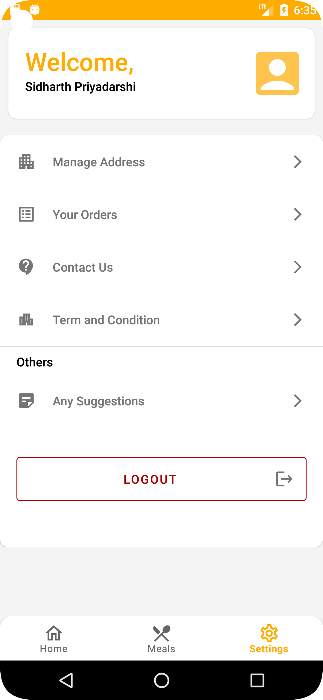
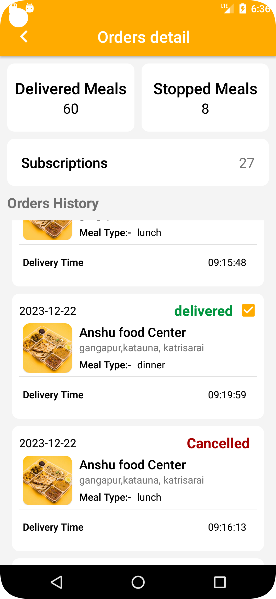

# Mesway - Find Mess Meal

Mesway is an Android application designed to simplify the process of finding nearby mess services and managing meal subscriptions, with features like password-less sign-in via OTP, user profile management, location-based search, and meal cancellation. Mesway offers flexible subscription plan tailored to user preferences with options spanning 1, 7, 15 and 30 days.

## Screenshots

      

## Features

- **Password-less Sign-in/Sign-up**: Authenticate users via OTP, eliminating the need for passwords and ensuring a secure login process.

- **User Profile Management**: Allow users to manage their profiles, including personal details and preferences, for a customized experience.

- **Location-Based Search**: Enable users to find nearby mess services based on their current location, enhancing convenience and accessibility.

- **Review and Rating System**: Empower users to leave reviews and ratings for mess services, facilitating informed decision-making for others.

- **Meal Cancellation Restrictions**: Implement meal cancellation restrictions based on specific times of the day(eg. After 7 am, breakfast cancellations are not permitted), ensuring order accuracy and reducing operational complexities.

- **Detailed Mess Profiles**: Provide comprehensive information about nearby mess services, including menu offerings, subscription plans, and operating hours, to help users make informed choices.

- **Subscription Plans**: Offer various subscription plans with customizable meal combinations, catering to diverse user preferences and schedules.

- **Notifications**: Send timely notifications to users for important updates such as order confirmations or reminders, enhancing user engagement and experience.

## Technologies Used

- **Language**: Java
- **Authentication**: OAuth2 using JWT token
- **Login & Signup**: OTP based login & Signup
- **Architecture**: MVVM (Model-View-ViewModel)
- **Navigation**: Android Navigation Component
- **LiveData**: Android Architecture Components (LiveData)
- **Notifications**: Firebase Cloud Messaging (FCM)
- **Retrofit**: For network requests
- **Glide**: For image loading
- **Backend Integration**: Utilizes FastAPI for backend services, PostgreSQL for the database, and AWS services (S3, Lambda, RDS) for deployment.

## Installation

Mesway is available for download on the [Google Play Store](https://play.google.com/store/apps/details?id=in.mesway). Simply visit the store page and install it on your Android device.
